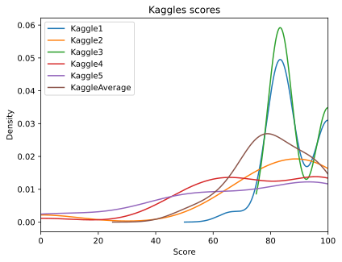

# MarkingCorrelation

Analysis of the correlation between two teachers marking a deep learning course.

|       | Examinator 1 - Examinator 2 | Project - Kaggle
--------|---------|-------
mean    | 6.296%  | 8.333%
meadian | 5.000%  | 7.500%
minimum | 2.500%  | 0.417%
maximum | 12.500% | 24.167%

